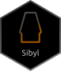

# Sibyl </a>

<!-- badges: start -->
[](https://app.codecov.io/gh/Headonpillow/Sibyl)
<!-- badges: end -->

**Sibyl** is a package designed to test different rarefaction thresholds when 
normalizing microbial abundance data.  

When performing Principal Component Analysis (PCA) and other types of ordination, 
it is necessary to make sure of choosing a rarefaction threshold which does not 
impact the structure of the data, or our conclusions, during exploratory analysis.  

# Installation

Some package dependencies are hosted on Bioconductor. In order to install them 
you need to install `{BiocManager}`:

``` r
if (!require("BiocManager", quietly = TRUE)) {
    install.packages("BiocManager")
}
BiocManager::install(version = "3.20")
```

### GitHub (development version)

You can install the latest development version of **Sibyl** from 
[Github](https://github.com/Headonpillow/Sibyl) with:

``` r
BiocManager::install("Headonpillow/Sibyl", 
dependencies = TRUE, build_vignettes = TRUE, force = TRUE)

```

### CRAN

Coming soon.

### Using bioconductor through docker

We actually recommend getting a working bioconductor installation through
[docker images for bioconductor](https://bioconductor.org/help/docker/). It is
not a requirement, however the use of containers allows for isolation of R
computing environments, which is a good thing. 
Those images leverage the [rocker project](https://github.com/rocker-org), which 
is also a great resource.

# Why using Sibyl

The **Sibyl** package was created with the aim of testing the lower limit of
rarefaction thresholds. 

While microbial abundance data is slowly moving away from methods like rarefaction
to account for differing library size, rarefaction has been extensively used 
and still in 2025 is present in much of the literature, and discussed.

When choosing a rarefaction threshold is common to need to operate a compromise 
between describing samples accurately (completeness), and including more samples,
which might sometimes not meet the selected threshold. 

**Sibyl** aims to solve that, allowing users to explore sample completeness, 
and the effect of rarefaction thresholds on ordinations, all with a single tool.
