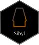

# Sibyl </a>

<!-- badges: start -->
[](https://app.codecov.io/gh/Headonpillow/Sibyl)
[](https://github.com/Headonpillow/Sibyl/actions/workflows/R-CMD-check.yaml)
[](https://headonpillow.r-universe.dev/)
<!-- badges: end -->

**Sibyl** is an R package for evaluating how sequencing-depth, and thus uncertainty on community composition, affects beta-diversity ordinations. 
It accomplishes this through a repeated-ordination framework, generating alternative representations of the same microbial count data, ordinating them, aligning them by Procrustes transformation, and summarizing sample positions
as consensus coordinates with uncertainty clouds. Sibyl currently supports two
uncertainty-generation workflows: repeated rarefaction and Dirichlet Monte Carlo sampling through **ALDEx2**.

The rarefaction workflow was Sibyl's original motivation, created to answer a
simple question: "How low can you go?".

# Installation

The easiest way to install **Sibyl** is from our R-Universe, which provides
prebuilt binaries for Windows and macOS, and source packages for Linux.
Bioconductor repositories are added automatically for dependencies like
**phyloseq**.

```r
# Sibyl requires R >= 4.2
if (getRversion() < "4.2.0")
  stop("Sibyl requires R >= 4.2.0. Please update R and try again.", call. = FALSE)

# Add Bioconductor if missing
if (!requireNamespace("BiocManager", quietly = TRUE))
  install.packages("BiocManager", repos = "https://cloud.r-project.org")

# Prefer R-Universe + BioC
options(repos = c(
  headonpillow = "https://headonpillow.r-universe.dev",
  BiocManager::repositories(),
  CRAN = "https://cloud.r-project.org"
))

install.packages("Sibyl")
library(Sibyl)
```

<details> <summary><strong>Linux users</strong>: if you see errors about missing system libraries</summary>

Some dependencies may build from source on Linux. If installation fails,
install the following system packages once and rerun the R code above.

**Ubuntu/Debian**

```bash
sudo apt update && sudo apt install -y \
  build-essential r-base-dev \
  libcurl4-openssl-dev libssl-dev libxml2-dev zlib1g-dev libgit2-dev \
  libjpeg-dev libpng-dev libx11-dev libglu1-mesa-dev freeglut3-dev libgl1-mesa-dev \
  liblapack-dev gfortran pkg-config
```

**Fedora**

```bash
sudo dnf install -y \
  R-devel @development-tools \
  libcurl-devel openssl-devel libxml2-devel zlib-devel libgit2-devel \
  libjpeg-turbo-devel libpng-devel libX11-devel mesa-libGLU-devel mesa-libGL-devel \
  lapack-devel blas-devel gcc-gfortran pkgconf-pkg-config
```

</details> 

# Why use Sibyl

Rarefaction threshold selection is one application of Sibyl's repeated-ordination framework, not its only purpose. 
It remains a useful entry point, though: while microbial abundance data is slowly moving away from methods like rarefaction to account for differing library size, rarefaction has been extensively used and is still, in 2025, present in much of the available literature, and still discussed.

When performing Principal Coordinates Analysis (PCoA) and other types of ordination, it is necessary to make sure that the chosen rarefaction threshold does not substantially affect the ordination structure, or our conclusions, during exploratory analysis. Usually, when choosing a rarefaction threshold researchers need to operate a compromise between describing samples accurately (completeness), and including more samples, which might sometimes not meet the selected threshold.

**Sibyl** helps by letting users explore sample completeness and the effect of
rarefaction thresholds on ordinations with a single tool. For datasets where
discarding reads through rarefaction is undesirable, the same downstream framework is also available through Dirichlet Monte Carlo sampling (via **ALDEx2**), which evaluates compositional uncertainty without subsampling.
